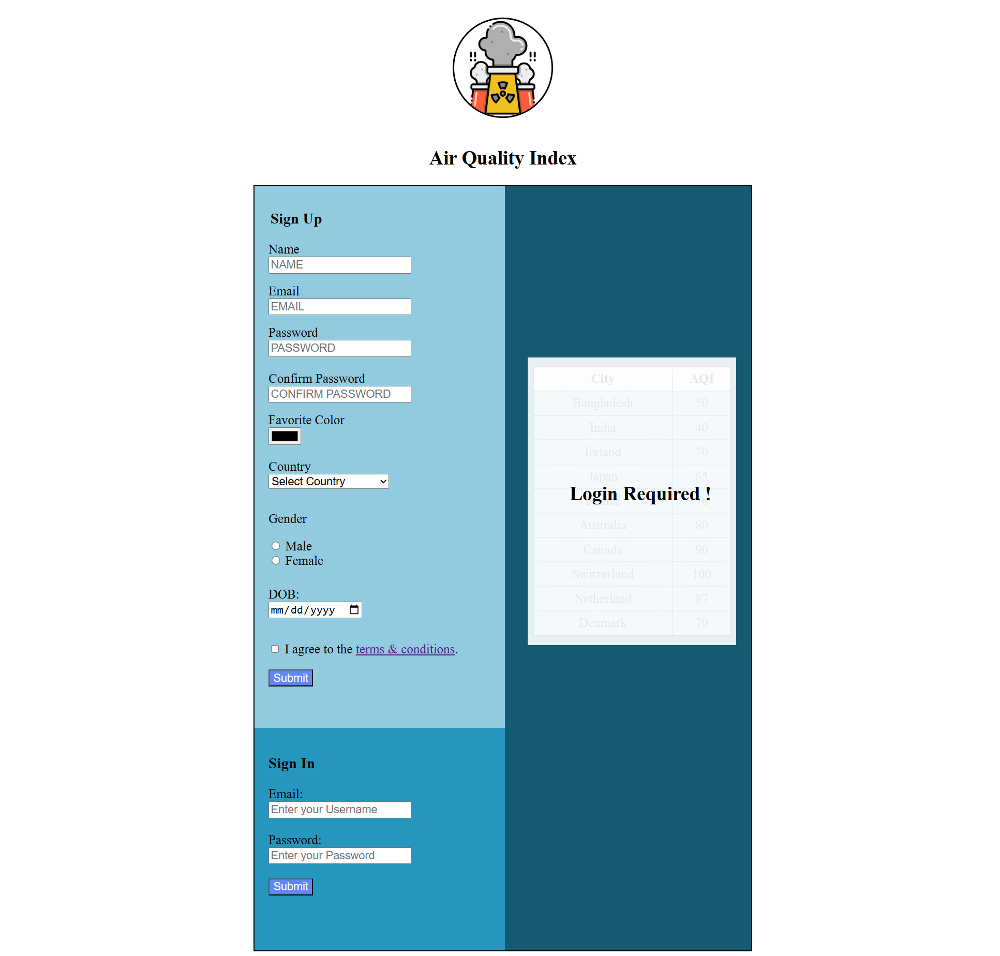
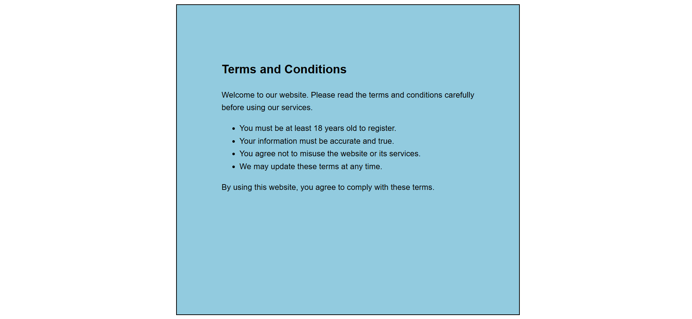
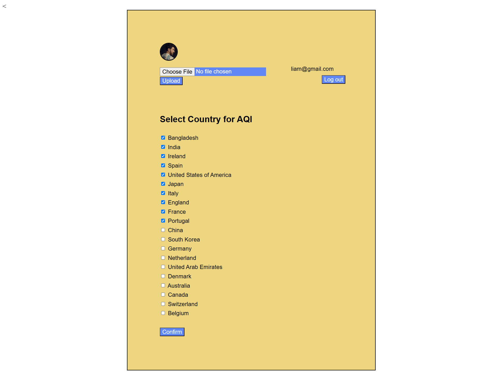
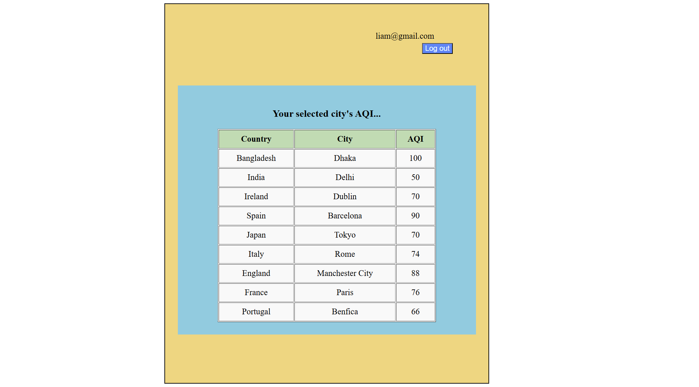
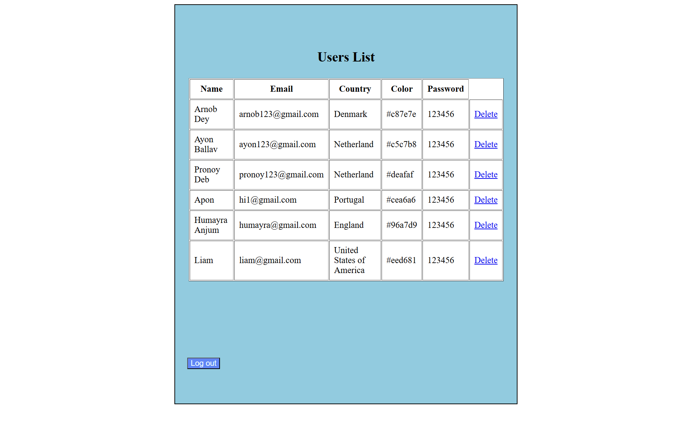

#  AQI (Air Quality Index) Website

##  About the Project

This is a simple website that shows the **Air Quality Index (AQI)** for different countries. I built it using **HTML, CSS, JavaScript**, and **PHP** as part of my learning journey.

The main goal was to get familiar with how these web technologies work together. My course teacher helped me a lot during this project, and I also learned from various online sources. It’s just a basic setup, but it’s a good starting point for going deeper into web development.

##  What It Can Do

The website has **7 pages** with different features:

- **Sign-Up and Login Pages** – So users can create an account and log in.
- **Country Selection Page** – Lets users choose **10 countries** from a list of 20.
- **AQI Display Page** – Shows the air quality for the countries the user selected.
- **Admin Page** – Admins can see all registered users and delete accounts if needed.
- **Receipt Page** – Shows a receipt or summary of the selection.
- **Terms & Conditions Page** – Explains the rules and usage terms.

## Screenshots

Here are some screenshots from the website:

### 1. Sign Up and Sign In  

### 2. Terms & Conditions  

### 3. Receipt  

### 4. Country Selection  

### 5. AQI Results for Selected Countries  

### 6. Admin Panel  

##  Tools & Technologies

- **Frontend:** HTML, CSS, JavaScript  
- **Backend:** PHP

##  Why I Made This

This project was part of my learning process. I wanted to understand how to build a basic website with both frontend and backend features. It’s not perfect, but it’s a great start. Learning by doing really helps.

##  Special Thanks

Big thanks to my **course teacher** for the support and guidance. Also, shoutout to the online tutorials and docs that helped me along the way.

